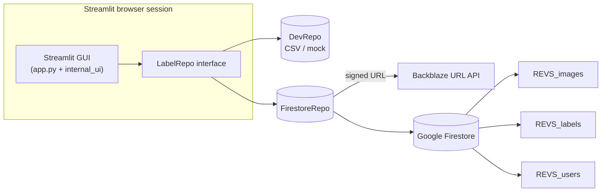

# Property-Image Labeling Tool
*A Streamlit + Firestore application for large-scale real-estate photo annotation*

---

## 1 · Repository layout
| Path | Purpose |
|------|---------|
| `app.py` | Main Streamlit application (modern, Firestore-ready). |
| `internal_ui.py` | All widgets, validation and state logic; ported from legacy. |
| `ui_components.py` | Thin façade that re-exports the UI helpers needed by `app.py`. |
| `taxonomy.py` | Location hierarchy, feature taxonomy & attribute rules. |
| `labeler_backend/base.py` | `LabelRepo` interface – storage-agnostic contract. |
| `labeler_backend/fire_repo.py` | Production Firestore implementation. |
| `labeler_backend/dev_repo.py` | CSV / in-memory implementation for local dev & tests. |
| `labeler_backend/factory.py` | Picks repo at runtime via `LABEL_REPO` env var. |
| `labeler_backend/bb_resolver.py` | Talks to Cloud-Run service that converts `bb_url` to a signed URL. |
| `legacy_app.py` | The original CSV prototype – kept as reference. |
| `images/` | Optional local folder scanned by `DevRepo`.

---

## 2 · Runtime architecture

Switch repo with `LABEL_REPO=dev` (default) or `firestore`.

---

## 3 · Firestore schema (v 1.0)
### 3.1 `REVS_images`
```jsonc
{
  "image_id"          : "uuid-v4",          // doc ID – shared key
  "property_id"       : "mongoId",         
  "image_hash"        : "sha256",
  "bb_url"            : "b2/path.jpg",
  "image_url"         : "https://cdn…",    // optional

  "status"            : "unlabeled | in_progress | labeled",
  "assigned_to"       : "user123 | null",
  "timestamp_uploaded": <timestamp>,
  "timestamp_assigned": <timestamp|null>,
  "timestamp_labeled" : <timestamp|null>,
  "task_expires_at"   : <timestamp|null>,
  "qa_status"         : "pending | approved | rejected",
  "flagged"           : false
}
```
*Composite indexes*
1. `(status, assigned_to)`
2. `(status, task_expires_at)`
3. `(status, timestamp_uploaded)`
4. `(flagged, status)` (optional)

### 3.2 `REVS_labels`
```jsonc
{
  "image_id"       : "uuid-v4",  // same as images doc
  "property_id"    : "mongoId",

  "spatial_labels" : ["Residential Interior", "… > Bathroom > Full"],
  "feature_labels" : ["Granite Countertop", "Double Sink"],
  "attributes"     : { "flooring_type": "Hardwood", … },
  "condition_scores": {
      "property_condition"      : 3.0,
      "quality_of_construction" : "High Quality",
      "improvement_condition"   : "Remodeled"
  },

  "notes"            : "needs white balance",
  "flagged"          : false,
  "schema_version"   : 1,
  "labeled_by"       : "user123",

  "timestamp_created": <ts>,        // first save
  "updated_at"       : <ts>         // last edit
}
```
`/revisions/` sub-collection stores previous payloads on every edit.

### 3.3 `REVS_users` (auth-enabled)
```jsonc
{
  "password_hash"         : "$2b$12$9…",      // bcrypt, never store plain-text
  "enabled"               : true,              // set false to block login
  "role"                  : "labeler",        // free-text (labeler | reviewer | admin …)

  // --- stats written by FirestoreRepo.save_labels() ---
  "last_labeled_image_id" : "uuid | null",
  "total_images_labeled"  : 122,
  "timestamp_last_labeled": <ts>
}
```

Legacy fields like `name` or `email` are optional.  Anything not present is simply ignored by the login gate.

---

## 4 · GUI workflow
1. Analyst enters **username**.  The value is used as `user_id`.
2. `repo.get_next_task(user_id)`
   * returns an `in_progress` image already assigned to the user, **or**
   * locks the next `unlabeled` doc (writes status→`in_progress`, sets `task_expires_at = now+60m`).
3. Image displayed via signed URL from Backblaze.
4. Analyst fills in:
   * **Location cascade** – any leaf produces *all* label prefixes.  Example "Full Bathroom" results in:
     ```json
     [
       "Residential Interior",
       "Residential Interior > Private Spaces",
       "Residential Interior > Private Spaces > Bathroom",
       "Residential Interior > Private Spaces > Bathroom > Full"
     ]
     ```
   * **Features** – multiselects (XOR with N/A).
   * **Contextual attributes** – dropdowns that change with the selected locations.
   * **Condition scores** – slider + two categorical ratings.
5. **Validation** (`internal_ui.can_move_on`) blocks navigation until every required widget is filled.
6. Clicking **Save** or **Next**:
   * writes/updates `REVS_labels/{image_id}` (includes `schema_version` and `updated_at`),
   * changes `REVS_images.status → "labeled"` and clears `task_expires_at`,
   * increments `total_images_labeled` and writes `last_labeled_image_id` in `REVS_users`.
7. Closing the tab: the Cloud-Scheduler job finds rows where `task_expires_at < now()` and resets them to `unlabeled`.

---

## 5 · Setup & execution
### 5.1 Local dev (CSV) --> TO BE IMPLEMENTED
```bash
python -m venv .venv && source .venv/bin/activate
pip install -r requirements.txt
export LABEL_REPO=dev
streamlit run app.py
```
Place JPG/PNG/WebP files inside `images/`.

### 5.2 Production (Firestore)
```bash
export FIRESTORE_CREDENTIALS_JSON=$(cat service-account.json)
export GCP_PROJECT_ID=my-gcp-project
export BB_RESOLVER_ENDPOINT=https://<cloud-run>/fetch-image-urls
export LABEL_REPO=firestore
streamlit run app.py
```
Docker:
```bash
docker build -t labeler:latest .
docker run -p 8501:8501 --env-file .env labeler:latest
```

#### 5.3  User authentication (new in v1.1)

The app now shows a **login screen**.  Credentials are stored in the `REVS_users` collection as bcrypt hashes.

• A tiny helper script `provision_user.py` creates or updates accounts.

```bash
# create a labeler
python -m admin_tools.provision_user alice S3cretPass!

# reviewer role
python -m admin_tools.provision_user bob MyPass --role reviewer

# disable an account (no password needed)
python -m admin_tools.provision_user bob --disable
```

If the document's `enabled` field is `false`, login is refused.

Environment discovery order for credentials used by the script and the app:
1. `FIRESTORE_CREDENTIALS_JSON` (raw JSON in env var)
2. `SERVICE_ACCOUNT_JSON` (path to file, read at runtime)
3. `GOOGLE_APPLICATION_CREDENTIALS` (standard ADC path)
4. Application-Default-Credentials on Cloud Run / gcloud

Dependency added: `bcrypt>=4.0.1` (already in `requirements.txt`).

#### 5.4  One-liner Docker runner

For convenience the repo ships with `run_labeler.sh`, a wrapper that builds (optional) and runs the container with all the right mounts and environment variables.

```bash
# first time – build image then run
./run_labeler.sh /path/to/service_account.json --build

# subsequent runs – skip rebuild
./run_labeler.sh /path/to/service_account.json
```

What the script does

1. Reads `.env` for variables such as `GCP_PROJECT_ID`, `BB_RESOLVER_ENDPOINT`, and `LABEL_REPO=firestore`.
2. Mounts the given service-account key read-only inside the container at `/secrets/key.json`.
3. Publishes Streamlit on port **8501** (UI at `/labeler`).
4. Gracefully cleans up the container on `Ctrl-C`; if a previous container is still running, it is auto-removed before launch.
5. Rebuilds the Docker image when `--build` is passed.

This saves you from memorising the full `docker run` incantation and guarantees consistent flags every time.

## 6 · Admin CLI toolkit

All maintenance scripts live in the package `admin_tools` and share the same
credential-discovery logic as the app (env var blob → key-file path → ADC).

Run any script with `python -m admin_tools.<script> --help` to see full
arguments.  Current commands:

| Script | Purpose |
|--------|---------|
| `provision_user` | Create, update, disable user accounts (bcrypt hashes). |
| `user_stats` | Show per-user counters and history. |
| `unlock_tasks` | Free `in_progress` images (filter by `--user`, `--stale`, or explicit `IMAGE_ID`). |
| `flagged_images` | List / unflag images marked `flagged=true`. |
| `retire_image` | Mark an image `status=removed` (and optionally delete its labels). |
| `wipe_labels` | Delete label documents for one or **all** images (safety flags required). |

### 6.1  Automated stale-lock cleanup

If you want this to run unattended instead of manually invoking
`unlock_tasks`, deploy a **Cloud Run Job** that executes:

```bash
# Dockerfile already contains cron_unlock.py
python cron_unlock.py      # equivalent to: unlock_tasks --stale --execute
```

Trigger the job daily via **Cloud Scheduler** (e.g. `0 2 * * *`).  Because the
job uses the same container image as the Streamlit service you can update it in
CI/CD with:

```bash
gcloud run jobs update unlock-daily \
  --image gcr.io/$PROJECT/labeler:$GITHUB_SHA --region us-central1
```

This keeps locks healthy without risking active work.

---

## 7 · Admin operations
| Task | How |
|------|-----|
| Ingest new photos | Insert docs in **REVS_images** with `status="unlabeled"`. |
| Provision / update user | `python -m admin_tools.provision_user <user> <pwd> [--role ROLE]` |
| Disable user | `python -m admin_tools.provision_user <user> --disable` or set `enabled=false` in UI. |
| Unlock tasks (manual) | `python -m admin_tools.unlock_tasks [IMG_ID] [--user USER] [--stale] --execute` |
| Retire image | `python -m admin_tools.retire_image IMG_ID [--wipe] --yes` |
| Review / unflag images | `python -m admin_tools.flagged_images [--user USER] [--unflag] [--execute]` |
| Wipe labels | `python -m admin_tools.wipe_labels IMG_ID --yes` or `--all --yes` |
| User stats | `python -m admin_tools.user_stats [user] [--history N]` |

---

## 8 · Extending
* **Taxonomy update** – bump `schema_version`, update `taxonomy.py`, migrate old docs or keep them read-only.
* **QA workflow** – use `qa_status` in **REVS_images** and enable reviewers to change it.
* **Analytics** – create `(property_id, timestamp_created)` index on **REVS_labels** for time-series per property.

---

## 9 · Troubleshooting
| Symptom | Likely cause |
|---------|--------------|
| Image fails to load | Wrong `bb_url` or resolver endpoint down. |
| "No more images" but queue not empty | Required composite indexes missing or all tasks locked. |
| Save button greyed | Validation failed – open *Current Selections* to see missing items. |

---

© 2025 Real Estate Vision Suite